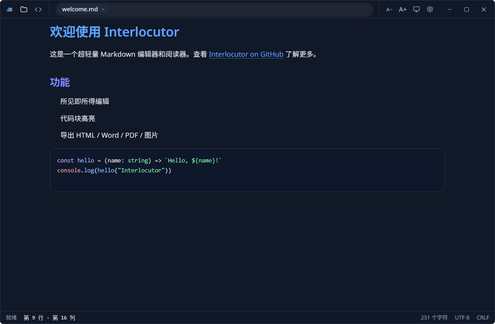

# Interlocutor

轻量级 Markdown 编辑与阅读桌面应用，基于 Vue 3、TypeScript、Vite 和 Tauri 2 构建，并附带一个纯 Rust 实现的 Markdown 解析内核。



## 功能特性

- 所见即所得编辑：基于 Tiptap，支持标题、列表、引用、链接、代码块高亮
- Markdown 源码模式：一键切换，直接编辑原始 Markdown
- 多标签页：新建、打开、保存 `.md`、`.markdown`、`.txt`
- 文件关联：安装后双击 Markdown 文件可直接打开，并支持单实例唤起
- 导出：HTML、Word、PDF、PNG
- 渲染：GFM、数学公式、代码高亮
- 显示设置：浅色、深色、跟随系统主题，以及四档字号
- 自定义界面：无边框标题栏、标签滑动指示器、悬浮滚动条、状态栏行列信息
- Windows：可将 Interlocutor 设为默认 Markdown 应用

## 技术栈

| 层 | 技术 |
| --- | --- |
| 前端 | Vue 3, TypeScript, Vite, Tailwind CSS |
| 编辑器 | Tiptap, lowlight, marked, Turndown |
| Markdown 渲染 | unified, remark, rehype, KaTeX, highlight.js |
| 桌面壳 | Tauri 2, Tauri Dialog Plugin |
| Rust 内核 | `markdown-core`：Lexer → Parser → AST → Renderer |

## 目录结构

```text
interlocutor/
├── src/                    # Vue 3 前端
│   ├── components/         # 标题栏、编辑器、工作区
│   ├── lib/                # 文件状态、Markdown、Word 导出
│   ├── styles/             # 代码高亮主题
│   └── main.ts
├── src-tauri/              # Tauri 2 桌面壳
│   ├── src/                # Rust 命令、窗口与文件关联
│   ├── markdown-core/      # 纯 Rust Markdown 解析内核
│   └── tauri.conf.json
├── public/                 # 静态资源
├── docs/screenshots/       # 项目截图
├── package.json
└── vite.config.ts
```

## 环境要求

- Windows 10/11（设为默认应用功能仅限 Windows）
- Node.js 20.19 或更高版本
- Rust stable 1.77.2 或更高版本
- npm

## 本地运行

安装依赖：

```bash
npm install
```

启动 Tauri 桌面开发模式：

```bash
npm run tauri
```

只预览前端界面（浏览器模式，文件打开与保存需要桌面环境）：

```bash
npm run dev
```

## 构建与测试

构建前端资源：

```bash
npm run build
```

构建桌面安装包：

```bash
npm run tauri:build
```

安装包输出在 `src-tauri/target/release/bundle/`。

运行 Rust Markdown 内核测试：

```bash
cd src-tauri/markdown-core
cargo test
```

## 快捷键

| 操作 | 快捷键 |
| --- | --- |
| 新建 | `Ctrl+N` |
| 打开 | `Ctrl+O` |
| 保存 | `Ctrl+S` |

## License

MIT
